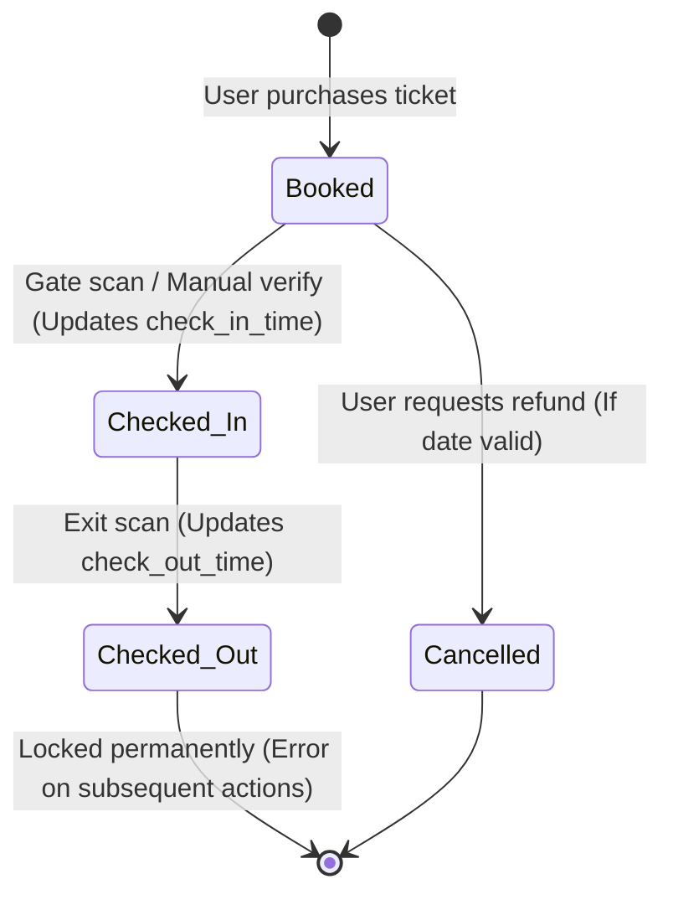

# Ticpin End-to-End Architecture Mapping & Verification Guide

This document provides a complete map of the Ticpin ticketing platform's verification, scanner, and dashboard flows. It traces every frontend interaction to its exact backend route, controller, service logic, GORM model, and Redis caching invalidation hook. It also details the linear state machine and provides a comprehensive QA testing script.

---

## 1. End-to-End Architecture File Map

| Flow Name | UI Component / Frontend File | HTTP Method | API Endpoint | Backend Router | Backend Controller | Backend Service | GORM Model | Redis Cache Key / Action |
| :--- | :--- | :--- | :--- | :--- | :--- | :--- | :--- | :--- |
| **User Booking** | `/ticpin/src/app/bookings/[id]/page.tsx` | `POST` | `/api/booking/create` | `routes/booking/booking.go` | `booking.CreateBooking` | `services/booking/create.go` | `models.Booking` | *None (writes straight to DB)* |
| **Ticket Scan (Check-in)** | `/Scanner/src/app/page.tsx` | `POST` | `/api/scanner/checkin` | `routes/scanner/scanner.go` | `scanner.PublicCheckIn` | *Inline Controller Logic* | `models.Booking`, `models.VerifiedBooking` | `org:{id}:event:{id}:attendees:*` (Invalidated via hook) |
| **Ticket Scan (Check-out)** | `/Scanner/src/app/page.tsx` | `POST` | `/api/scanner/checkout` | `routes/scanner/scanner.go` | `scanner.PublicCheckOut` | *Inline Controller Logic* | `models.Booking`, `models.VerifiedBooking` | `org:{id}:event:{id}:attendees:*` (Invalidated via hook) |
| **Dashboard Gate Logs** | `/ticpin/src/components/organizer/overview/GateControlTab.tsx` | `GET` | `/backend/api/organizer/overview/gatecontrol` | `routes/organizer/gatecontrol/gatecontrol.go` | `gatecontrol.GetGateLogs` | `services/organizer/gatecontrol/gatecontrol.go` | `models.GateControlLog` | `org:{id}:event:{id}:gatecontrol:*` (Cached) |
| **Admin Manual Verify** | `/ticpin/src/components/organizer/overview/GateControlTab.tsx` | `POST` | `/backend/api/organizer/overview/gatecontrol/manual-verify` | `routes/organizer/gatecontrol/gatecontrol.go` | `gatecontrol.ManualVerify` | `services/organizer/attendes/attendes.go#VerifyAttendee` | `models.Booking`, `models.VerifiedBooking` | Calls `InvalidateAttendeesCache` |
| **PAN Verification** | `/ticpin/src/app/organizer/dashboard/page.tsx` | `POST` | `/api/organizer/verify-pan` | `routes/organizer/organizer.go` | `orgver.VerifyPANHandler` | `services/verification/cashfree.go#VerifyPAN` | `models.Organizer`, `models.OrganizerVerification` | *None* |
| **GST Verification** | `/ticpin/src/app/organizer/dashboard/page.tsx` | `POST` | `/api/organizer/fetch-gst` | `routes/organizer/organizer.go` | `orgver.FetchGSTHandler` | `services/verification/cashfree.go#VerifyGSTIN` | `models.Organizer`, `models.OrganizerVerification` | *None* |
| **User Ticket Cancellation** | `/ticpin/src/app/bookings/[id]/page.tsx` | `POST` | `/api/booking/cancel/:id` | `routes/booking/booking.go` | `bookinguser.CancelBooking` | `services/booking/cancel.go` | `models.Booking` (Checks validity) | *None* |

---

## 2. The Verification State Machine (Linear Flow)

The platform enforces a strict, linear progression of states. Once a ticket reaches the **Checked Out** terminal state, it is locked permanently and cannot be manipulated further by scanners or dashboard administrators.



### State Guards in Code
*   **Check-In Guard:** If state is `checked_in`, scanner throws *"ticket is already checked-in"*. If state is `checked_out`, scanner throws *"ticket has already been checked out"*.
*   **Check-Out Guard:** If state is `booked`, scanner throws *"ticket must be checked-in before checking out"*. If state is `checked_out`, scanner throws *"ticket has already been checked out"*.
*   **Manual Admin Override Guard:** If state is `checked_out`, backend returns a `400 Bad Request` with: *"ticket has already been checked out and cannot be used again"*.

---

## 3. Redis Integration & Cache Invalidation

To maintain peak performance during high-throughput check-ins, attendee lists and gate logs are aggressively cached in Redis. When any check-in/out or manual verification occurs, the cache is instantly invalidated to keep dashboard stats real-time.

### Cache Key Namespaces:
*   **Attendee List:** `org:{organizer_id}:event:{event_id}:attendees:{md5_hash_of_filters}`
*   **Gate Control Logs:** `org:{organizer_id}:event:{event_id}:gatecontrol:{page_limit}`
*   **Dashboard Stats:** `organizer_overview:dashboard:{organizer_id}:{event_id}`

### Invalidation Logic (`services/organizer/attendes/attendes.go`):
```go
func InvalidateAttendeesCache(organizerID, eventID string) {
    // Clears the entire list of attendees for the event
    cache.GlobalCache.DeleteByPrefix(fmt.Sprintf("org:%s:event:%s:attendees:", organizerID, eventID))
    // Clears the gate control log history
    cache.GlobalCache.DeleteByPrefix(fmt.Sprintf("org:%s:event:%s:gatecontrol:", organizerID, eventID))
    // Resets the overview dashboard numbers (Total checked-in, gate counts)
    cache.GlobalCache.DeleteByPrefix(fmt.Sprintf("organizer_overview:dashboard:%s:%s", organizerID, eventID))
    // Invalidates internal cache for event details
    myevents.InvalidateEventBookings(organizerID, eventID)
    gatecontrol.InvalidateGateCache(organizerID, eventID)
}
```

---

## 4. End-to-End QA Testing Prompts

You can use the following scripts to verify that every component functions perfectly.

### Test Case A: Scanner Check-In & Check-Out Flow
1. **Objective:** Verify a ticket can check in, check out, and then lock itself.
2. **Action 1 (Check-In):** Scan a fresh `Confirmed` QR code.
   * *Expected Result:* Bottom sheet slides up. Status pill is green. Clicking **Check In** triggers a success tone, records the check-in time, and changes the button to **Check Out**.
3. **Action 2 (Re-Scan Check-In):** Scan the same ticket again.
   * *Expected Result:* Shows "Checked-In" status. Only the "Check Out" button is visible. No audio alert is played.
4. **Action 3 (Check-Out):** Click **Check Out**.
   * *Expected Result:* Success. UI updates. Both check-in and check-out times are rendered. Buttons vanish.
5. **Action 4 (Lockout Verification):** Scan the ticket a 3rd time.
   * *Expected Result:* Opens the bottom sheet. Displays both timestamps. No buttons are present. Status card indicates Checked Out.

### Test Case B: Admin Bypass Prevention
1. **Objective:** Verify the dashboard manual verification cannot resurrect a checked-out ticket.
2. **Action:** Copy the Booking ID of the Checked-Out ticket from Test Case A. Go to **Organizer Dashboard → Gate Control Tab → Manual Check-in**. Paste the ID and click **Verify**.
   * *Expected Result:* The modal returns an error message: *"ticket has already been checked out and cannot be used again"*. The state remains untouched.

### Test Case C: Timezone Consistency (IST Verification)
1. **Objective:** Verify that timestamps recorded on Cloudflare match Asia/Kolkata (IST).
2. **Action:** Run a check-in at exactly `09:15 PM IST`. Inspect the gate logs list on the organizer dashboard.
   * *Expected Result:* The checked-in log displays `09:15 PM` rather than UTC `03:45 PM`. The date displays the correct day in India (e.g. `Mon, Jun 22`).

### Test Case D: PAN & GST Real-time Validation
1. **Objective:** Verify Cashfree verification services work.
2. **Action 1 (PAN):** Input a valid PAN Card code and corresponding Register Name in the organizer profile. Submit.
   * *Expected Result:* Hits `/api/organizer/verify-pan`, reaches Cashfree API, compares names, and sets `pan_verified = true` in DB.
3. **Action 2 (GST):** Input a valid GSTIN number in the profile. Submit.
   * *Expected Result:* Hits `/api/organizer/fetch-gst`, fetches GST registry details, and populates registered company details automatically.
